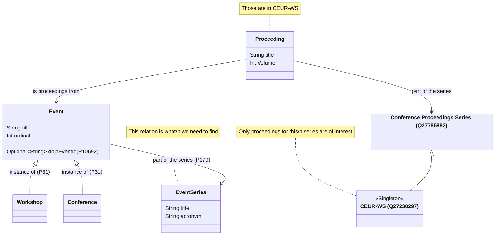
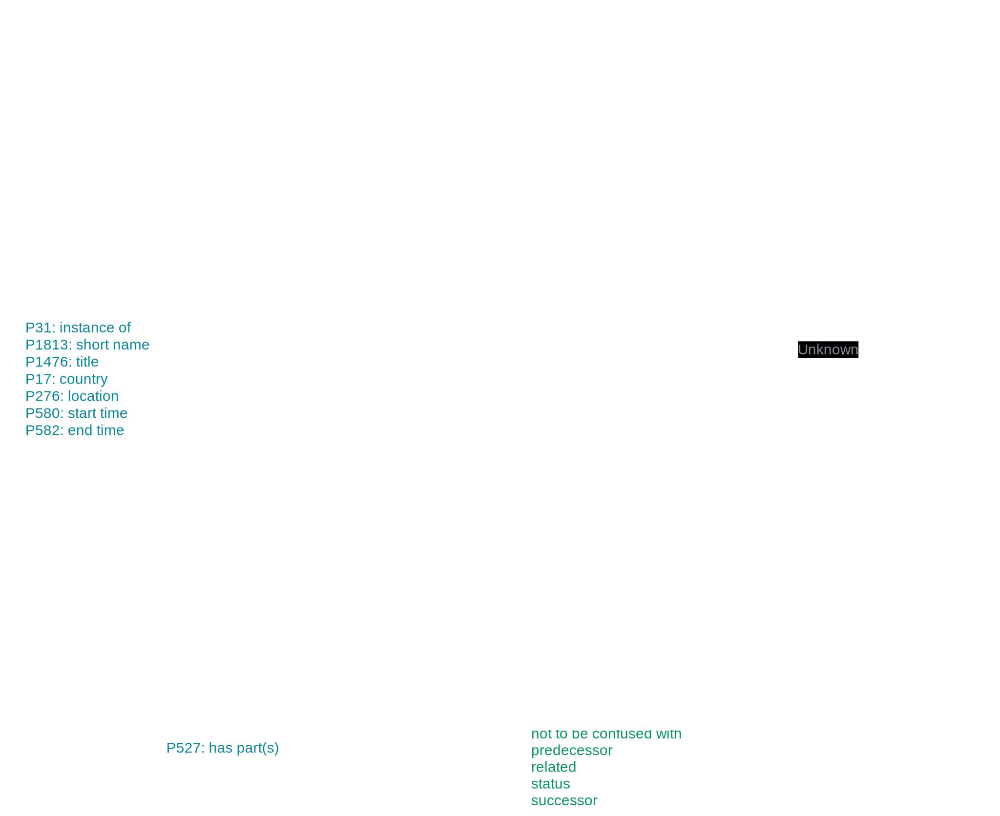
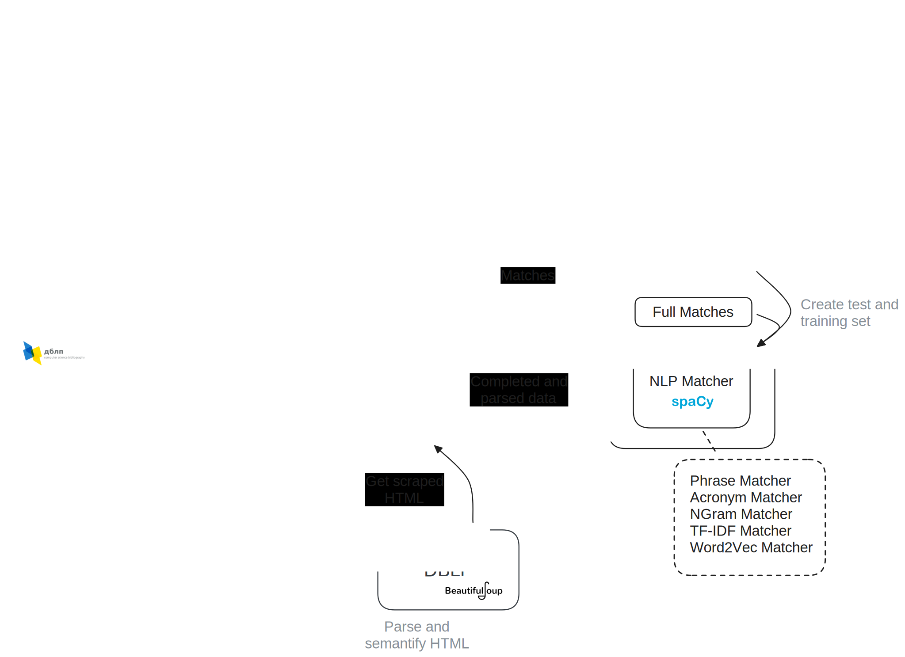

# Event Series Completion Group Project 2023

### Task

1. Find [CEUR-WS](https://ceur-ws.org/) related academic events in [Wikidata](https://www.wikidata.org/wiki/Q27230297)
2. Some events have the [property 179](https://www.wikidata.org/wiki/Property:P179) (**part of the series**)
3. For all events that don't have this property find whether,
    - they are part of a conference/workshop series or
    - they are a standalone event
6. Match events to their event series and update the property.

#### Relations of Proceedings, Events, Series

  - You can edit this file at [Excalidraw](https://excalidraw.com/)

### Progress

- Two main approaches
  - Match directly based on attributes (title, acronym)
  - Match through DBLP
- Extracted relevant events from Wikidata
- Implemented various matching-algorithms mostly comparing titles
- Parsed and scraped events and their series from [dblp](https://dblp.org) that are related to CEUR-WS
    - Extracted meta-information, event-information, event-series-information
    - Matched conferences to their series through dblp
- More information can be found in the [final presentation](docs/Final%20Prensentation.pdf)
- 

### Structure

- 
  - The excalidraw information is embedded in the file
- The main module is `eventseries`
- Test are found in `eventseries/src/tests`
  - More information about *dblp* can be found in `eventseries/src/main/dblp`
  - Resources like `.json`, `.pickle` or `.csv` files are located
    in `eventseries/src/main/resources`
- Dataexploration and experiments are within notebooks in `notebooks`
  - Data used within the notebooks should be placed in `data`

#### Known Issues

- Classification of events
  - A lot of workshops are classified as conference and not academic workshop
  - Some conferences are classified as workshops,
    likely due to missing disambiguation between the conference and a workshop hosted at that
    conference
    - http://www.wikidata.org/entity/Q113638423'
    - http://www.wikidata.org/entity/Q113637342'
    - http://www.wikidata.org/entity/Q113674405'
    - http://www.wikidata.org/entity/Q113649411'
    - http://www.wikidata.org/entity/Q113922773'
    - http://www.wikidata.org/entity/Q118164538'
    - http://www.wikidata.org/entity/Q113656570'
    - http://www.wikidata.org/entity/Q113646150'
    - http://www.wikidata.org/entity/Q113672458'
    - http://www.wikidata.org/entity/Q113625151'
    - http://www.wikidata.org/entity/Q113623296'
    - http://www.wikidata.org/entity/Q113649178'
    - http://www.wikidata.org/entity/Q113576146'
- Bad WikiData entries
  - [No meaningful label or title](https://www.wikidata.org/wiki/Q113672449)
  - Invalid [dblp-id](https://www.wikidata.org/wiki/Q113580007)
